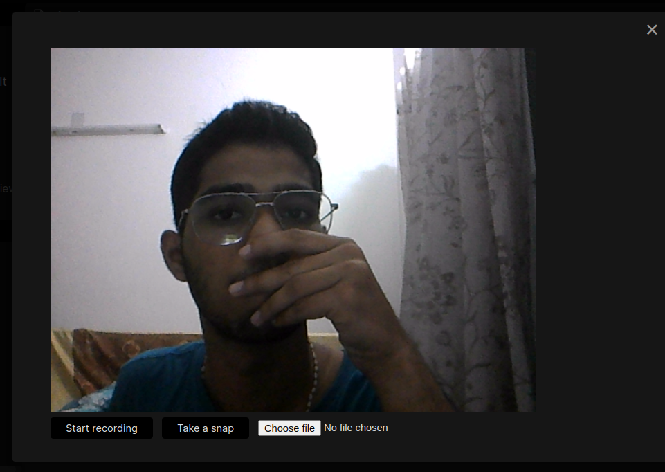

# Obsidian Camera

Camera plugin for Obsidian(https://obsidian.md).

### Features

-   Take photo and video recordings and have them saved in vault
-   Create and paste links to the recording automatically if a markdown file is open
-   File picker

## Installataion

Install directly by browsing from community plugins.

Or

### Manual Installation:

-   Create a new folder called obsidian-camera in `VaultFolder/.obsidian/plugins` folder
-   Copy the `main.js` and `manifest.json` files to this folder
-   reload Obsidian
-   enable "Obsidian Camera" extension under Settings>Community plugins>Installed pluggins

## Usage:

-   Open command palete and search for "camera" once the extension is enabled
    OR
-   Click the camera icon in the left ribbon

## Demo

<!--  -->

<!--  -->

<!--  -->
